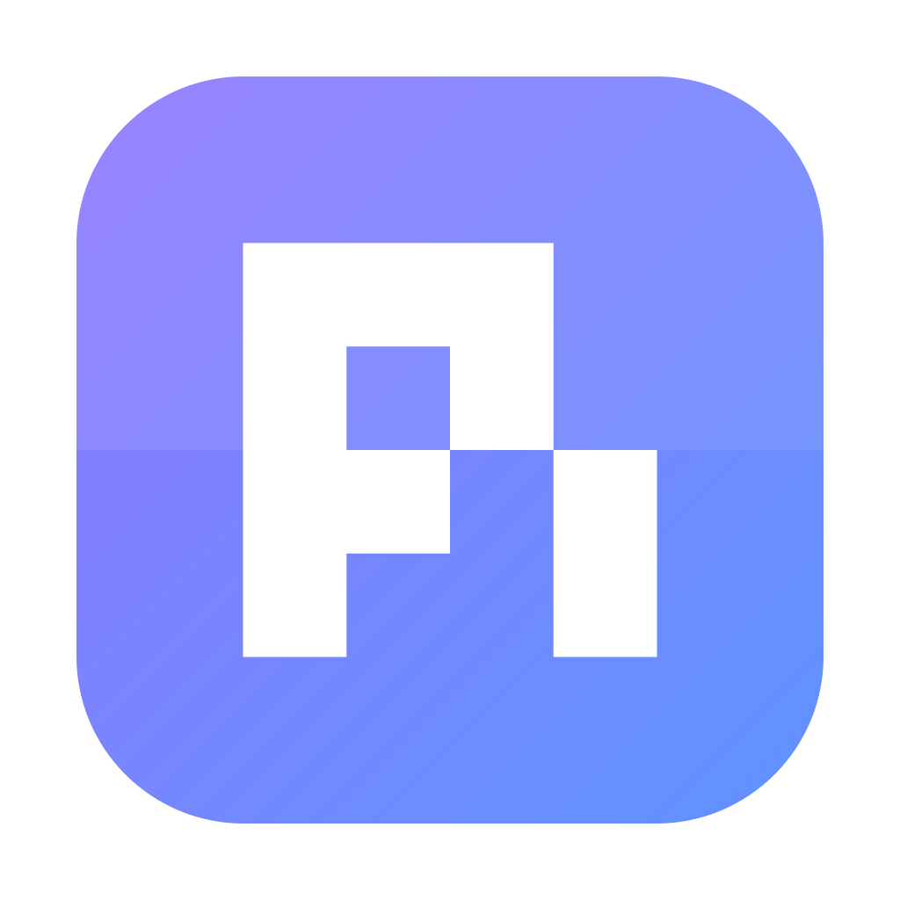
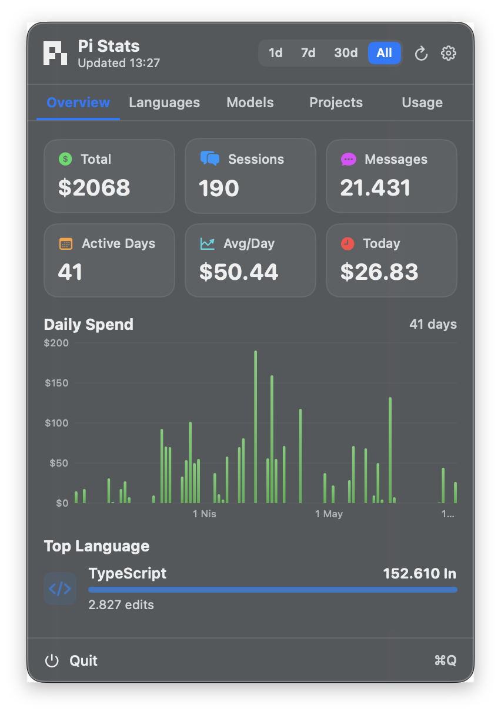
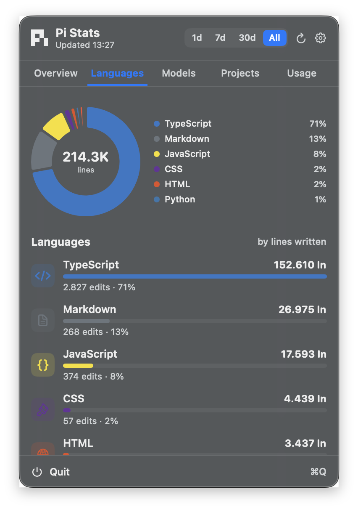
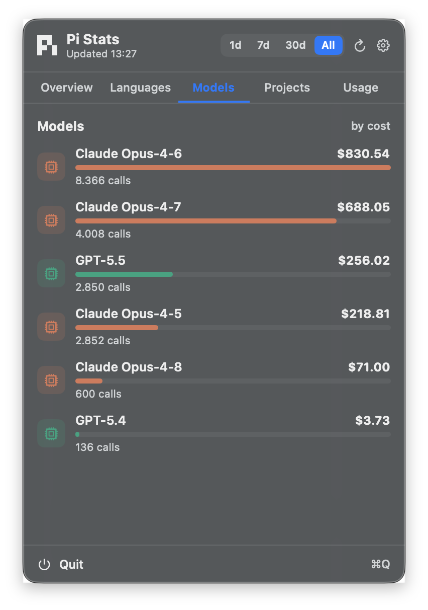
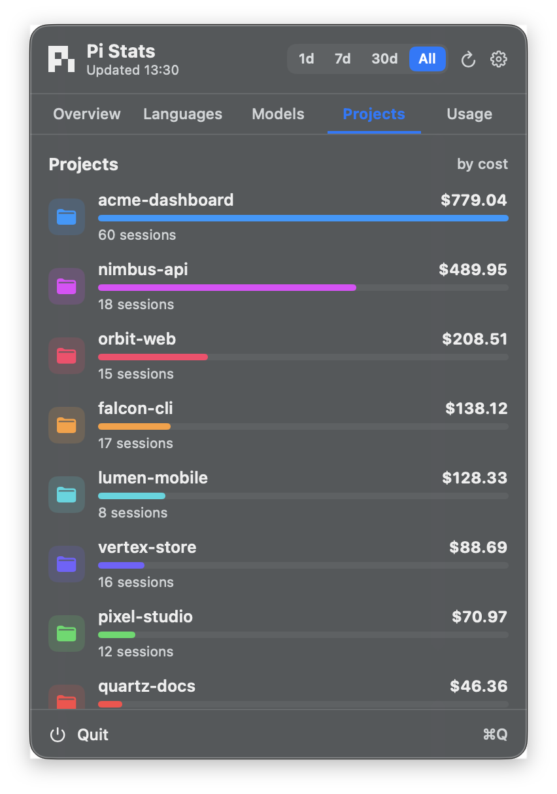
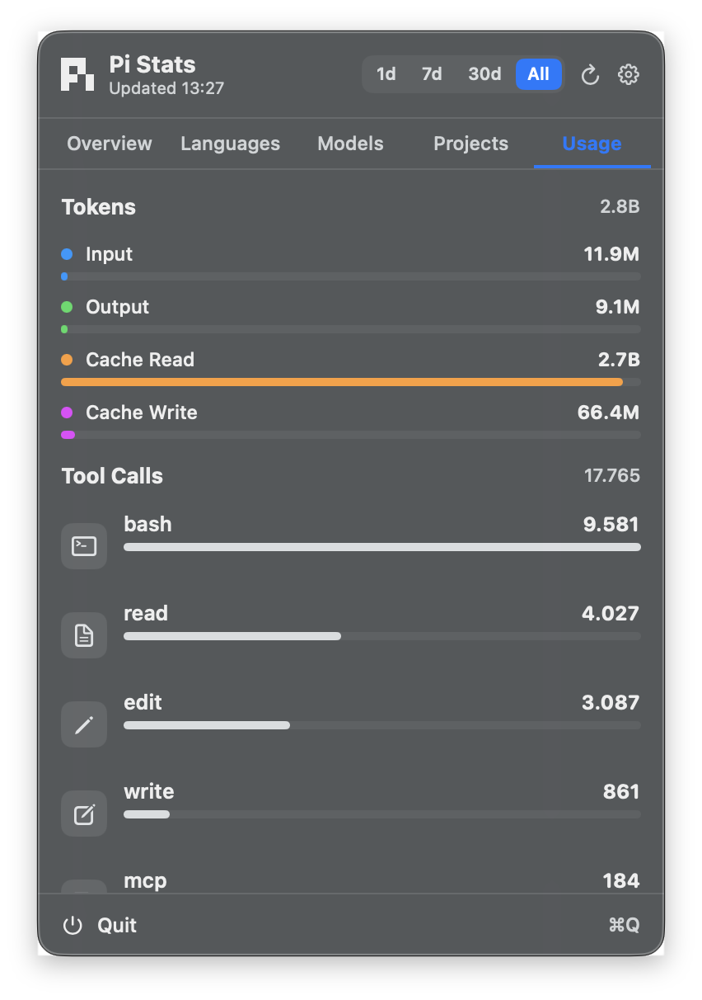

<div align="center">



# Pi Stats

**A native macOS menu-bar dashboard for your [Pi](https://pi.dev) agent usage.**

See your total spend, the languages you actually code in, model costs, projects
and token usage — all computed locally from your session logs. Nothing leaves your Mac.

<a href="https://github.com/phun333/pi-infobar/releases/tag/v0.1.0"></a>


</div>

<br />

<div align="center">

&nbsp;

</div>

<br />

<div align="center">

&nbsp;

&nbsp;

</div>

<br />

## Features

- **Cost** — today's spend in the menu bar; total / avg / daily-spend chart.
- **Languages** — donut + ranked bars by lines written (TypeScript, Python, Swift, Go…).
- **Models, Projects, Tokens & Tools** — cost and counts, per item.
- **Time ranges** — `1d / 7d / 30d / All` across every tab.
- **Native** — translucent rounded panel, ⌘Q, launch-at-login, Settings window.
- **Private** — reads only `~/.pi/agent/sessions`. No network.

## Download

**[Download Pi Stats v0.1.0 →](https://github.com/phun333/pi-infobar/releases/tag/v0.1.0)**

Open the DMG, drag **Pi Stats** to Applications. First launch: right-click → **Open**
(unsigned build, one-time Gatekeeper prompt). The **π** mark then lives in your menu bar.

## How it works

Streams every `~/.pi/agent/sessions/**/*.jsonl`, aggregates per day, and caches the
result. Cost comes from each message's recorded `usage.cost` (no estimates); languages
from the file extension of every `edit`/`write`; projects from each session's `cwd`.

## Build

Swift 6 toolchain (Command Line Tools, no full Xcode):

```bash
./build_app.sh && open "build/Pi Stats.app"   # build + run
./release.sh v0.2.0                            # package DMG/zip + GitHub release
```

## License

MIT — see [LICENSE](LICENSE).
